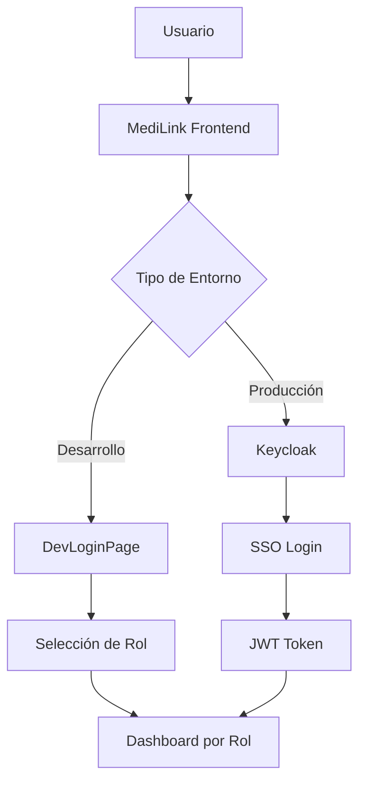

# MediLink Frontend 🩺✨

<div align="center">

  
  
  
  

  
  
  
  
  
  
  
  

</div>


<div align="center">
  
</div>


Plataforma moderna de telemedicina con autenticación enterprise y cumplimiento FHIR.

## 📋 Índice

1. [🗒️ Descripción del Proyecto](#️-descripción-del-proyecto)
2. [🚀 Características Principales](#-características-principales)
3. [🛠️ Tecnologías Utilizadas](#️-tecnologías-utilizadas)
4. [🏁 Puesta en Marcha](#-puesta-en-marcha)
5. [🏛️ Arquitectura del Frontend](#️-arquitectura-del-frontend)
6. [🔐 Autenticación y Seguridad](#-autenticación-y-seguridad)
7. [👥 Gestión de Roles](#-gestión-de-roles)
8. [📜 Scripts Disponibles](#-scripts-disponibles)
9. [🌐 Deployment](#-deployment)
10. [🤝 Cómo Contribuir](#-cómo-contribuir)
11. [📝 Changelog](#-changelog)

## 🗒️ Descripción del Proyecto

**MediLink** es una plataforma web moderna y escalable diseñada para revolucionar la gestión médica digital. Desarrollada con tecnologías de vanguardia, ofrece una solución integral para clínicas, centros de salud y profesionales médicos independientes.

### 🎯 Objetivos Clave

- **Centralización**: Unificar la gestión de citas, historiales y comunicación
- **Interoperabilidad**: Integración nativa con sistemas EHR mediante estándar FHIR
- **Seguridad**: Autenticación enterprise con Keycloak y cumplimiento HIPAA
- **Escalabilidad**: Arquitectura modular preparada para crecimiento empresarial

## 🚀 Características Principales

### 👤 Portal de Pacientes

- ✅ **Gestión de Citas**: Agendar, modificar y cancelar citas en tiempo real
- ✅ **Historial Clínico**: Acceso seguro a registros médicos personales
- ✅ **Notificaciones**: Recordatorios automáticos y actualizaciones de estado
- ✅ **Perfil Médico**: Gestión de información personal y preferencias

### 👨‍⚕️ Portal de Profesionales

- ✅ **Agenda Inteligente**: Gestión de disponibilidad con sincronización automática
- ✅ **Expedientes Médicos**: Acceso completo a historiales de pacientes
- ✅ **Teleconsultas**: Videollamadas seguras integradas en la plataforma
- ✅ **Dashboard Analítico**: Métricas de consultas y gestión de tiempo

### 🛡️ Portal de Administración

- ✅ **Gestión de Usuarios**: Control completo de pacientes y profesionales
- ✅ **Configuración del Sistema**: Personalización de flujos y notificaciones
- ✅ **Reportes Avanzados**: Analytics detallados de uso y rendimiento
- ✅ **Control de Acceso**: Gestión granular de permisos y roles

### 🔧 Características Técnicas

- ✅ **Cumplimiento FHIR**: Integración nativa con sistemas EHR existentes
- ✅ **Autenticación SSO**: Keycloak para autenticación enterprise
- ✅ **Diseño Responsivo**: Optimizado para móviles, tablets y escritorio
- ✅ **Tiempo Real**: Actualizaciones instantáneas sin refrescar
- ✅ **PWA Ready**: Funcionalidad offline y instalación como app

## 🛠️ Tecnologías Utilizadas

### Frontend Core

- **React 18+** - Biblioteca de UI con Concurrent Features
- **TypeScript** - Tipado estático para mayor robustez
- **Vite** - Build tool ultrarrápido con Hot-Reload
- **Tailwind CSS v4** - Utility-first CSS framework

### Autenticación & Seguridad

- **Keycloak** - Solución enterprise de autenticación y autorización
- **JWT Tokens** - Autenticación stateless y segura
- **Role-Based Access Control (RBAC)** - Control granular de permisos

### Gestión de Estado & Datos

- **React Router v6** - Enrutado con lazy loading
- **React Hook Form** - Gestión eficiente de formularios
- **Zod** - Validación de esquemas TypeScript-first
- **React Query/TanStack Query** - Gestión de estado del servidor

### UI/UX

- **shadcn/ui** - Componentes accesibles y customizables
- **Lucide React** - Iconografía moderna y consistente
- **Framer Motion** - Animaciones fluidas y naturales
- **Radix UI** - Primitivos de UI accesibles

### Herramientas de Desarrollo

- **ESLint** - Linting con reglas personalizadas
- **Prettier** - Formateo automático de código
- **pnpm** - Gestor de paquetes eficiente
- **Husky** - Git hooks para calidad de código

## 🏁 Puesta en Marcha

### Prerrequisitos

- **Node.js** >= 18.0.0
- **pnpm** >= 8.0.0
- **Git**

### Instalación

1. **Clonar el repositorio**

   ```bash
   git clone https://github.com/Medilink-Team40/MediLink-Frotend.git
   cd MediLink-Frotend
   ```

2. **Instalar dependencias**

   ```bash
   pnpm install
   ```

3. **Configurar variables de entorno**

   ```bash
   cp .env.example .env
   ```

   Edita el archivo `.env`:

   ```env
   # API Configuration
   VITE_API_URL=http://localhost:3000/api

   # Keycloak Configuration
   VITE_KEYCLOAK_URL=https://keycloak-production-2d31.up.railway.app
   VITE_KEYCLOAK_REALM=MediLink
   VITE_KEYCLOAK_CLIENT_ID=medilink-frontend

   # Feature Flags
   VITE_ENABLE_TELECONSULTA=true
   VITE_ENABLE_ANALYTICS=true
   ```

4. **Ejecutar en desarrollo**

   ```bash
   pnpm dev
   ```

   La aplicación estará disponible en `http://localhost:5173`

## 🏛️ Arquitectura del Frontend

### Patrón Feature-Based Architecture

```
src/
├── 📁 assets/           # Recursos estáticos
│   ├── images/         # Imágenes y logos
│   └── icons/          # Iconografía personalizada
├── 📁 components/       # Componentes reutilizables
│   ├── ui/             # Componentes base (shadcn/ui)
│   ├── layout/         # Layouts de aplicación
│   └── common/         # Componentes compartidos
├── 📁 config/           # Configuración de aplicación
│   ├── AuthProvider.tsx # Context de autenticación
│   ├── keycloak.ts     # Configuración Keycloak
│   └── env.ts          # Variables de entorno
├── 📁 features/         # Módulos por funcionalidad
│   ├── auth/           # Autenticación
│   ├── patients/       # Gestión de pacientes
│   ├── appointments/   # Sistema de citas
│   ├── dashboard/      # Dashboards por rol
│   └── admin/          # Administración
├── 📁 hooks/            # Hooks personalizados
│   ├── useAuth.ts      # Hook de autenticación
│   ├── useApi.ts       # Hook para API calls
│   └── usePermissions.ts # Hook de permisos
├── 📁 lib/              # Utilidades y helpers
│   ├── api.ts          # Cliente HTTP
│   ├── utils.ts        # Funciones utilitarias
│   └── constants.ts    # Constantes globales
├── 📁 routes/           # Configuración de rutas
│   ├── ProtectedRoute.tsx # Rutas protegidas
│   ├── AdminRoute.tsx     # Rutas de admin
│   └── router.tsx         # Configuración principal
├── 📁 types/            # Definiciones TypeScript
│   ├── api.types.ts    # Tipos de API
│   ├── auth.types.ts   # Tipos de autenticación
│   └── global.types.ts # Tipos globales
└── 📁 utils/            # Utilidades específicas
    ├── formatters.ts   # Formateo de datos
    └── validators.ts   # Validaciones
```

### Principios de Diseño

- **Separación de Responsabilidades**: Cada módulo tiene una responsabilidad específica
- **Reutilización**: Componentes y hooks reutilizables
- **Tipado Fuerte**: TypeScript en todos los niveles
- **Lazy Loading**: Carga diferida de componentes para mejor performance
- **Error Boundaries**: Manejo robusto de errores

## 🔐 Autenticación y Seguridad

### Flujo de Autenticación



### Características de Seguridad

- **🔒 Autenticación SSO**: Keycloak para autenticación centralizada
- **🎫 JWT Tokens**: Tokens seguros con expiración automática
- **🛡️ RBAC**: Control de acceso basado en roles
- **🔄 Token Refresh**: Renovación automática de tokens
- **🚪 Logout Seguro**: Invalidación completa de sesión

## 👥 Gestión de Roles

### Roles del Sistema

| Rol | Permisos | Dashboard | Funcionalidades |
|-----|----------|-----------|-----------------|
| **👨‍⚕️ Doctor** | Gestión de pacientes y citas | `/doctor/dashboard` | Agenda, Pacientes, Teleconsultas |
| **👤 Paciente** | Gestión personal | `/patient/dashboard` | Citas, Historial, Perfil |
| **🛡️ Admin** | Control total | `/admin/dashboard` | Usuarios, Configuración, Reportes |

### Rutas Protegidas

```typescript
// Ejemplo de protección de rutas
<ProtectedRoute allowedRoles={['doctor', 'admin']}>
  <DoctorDashboard />
</ProtectedRoute>
```

## 📜 Scripts Disponibles

```bash
# Desarrollo
pnpm dev          # Servidor de desarrollo con hot-reload
pnpm dev:host     # Servidor accesible en red local

# Build y Testing
pnpm build        # Compilación para producción
pnpm preview      # Preview de build de producción
pnpm type-check   # Verificación de tipos TypeScript

# Calidad de Código
pnpm lint         # Análisis con ESLint
pnpm lint:fix     # Corrección automática de ESLint
pnpm format       # Formateo con Prettier

# Utilidades
pnpm clean        # Limpieza de cache y dependencias
pnpm analyze      # Análisis del bundle de producción
```

## 🌐 Deployment

### Build para Producción

```bash
# Build optimizado
pnpm build

# Verificar build
pnpm preview
```

### Variables de Entorno Requeridas

```env
# Producción
VITE_KEYCLOAK_URL=https://your-keycloak-domain.com
VITE_KEYCLOAK_REALM=MediLink
VITE_KEYCLOAK_CLIENT_ID=medilink-frontend
VITE_API_URL=https://your-api-domain.com
```

### Plataformas Soportadas

- ✅ **Vercel** - Deploy automático desde Git
- ✅ **Netlify** - Integración continua
- ✅ **Railway** - Full-stack deployment
- ✅ **AWS S3 + CloudFront** - Escalabilidad enterprise

### Configuración de Keycloak

En el Admin Console de Keycloak:

1. **Client Settings**:

   ```
   Client ID: medilink-frontend
   Client Protocol: openid-connect
   Access Type: public
   ```

2. **Valid Redirect URIs**:

   ```
   https://your-domain.com/auth/callback
   https://your-domain.com/*
   ```

3. **Web Origins**:

   ```
   https://your-domain.com
   ```

## 🤝 Cómo Contribuir

### Workflow de Contribución

1. **Fork del repositorio**
2. **Crear rama feature**:

   ```bash
   git checkout -b feature/nueva-funcionalidad
   ```

3. **Desarrollar y testear**
4. **Commit con formato convencional**:

   ```bash
   git commit -m "feat: agregar autenticación biométrica"
   ```

5. **Push y Pull Request**

### Estándares de Código

- **TypeScript estricto**: Todos los archivos deben estar tipados
- **ESLint + Prettier**: Código consistente y formateado
- **Conventional Commits**: Commits semánticos
- **Component Testing**: Tests para componentes críticos

### Estructura de Commits

```
feat: nueva funcionalidad
fix: corrección de bug
docs: actualización de documentación
style: cambios de formato
refactor: refactoring de código
test: agregado de tests
chore: tareas de mantenimiento
```

## 📝 Changelog

### v1.0.0 (2025-10-30)

- ✨ **feat**: Sistema de autenticación completo con Keycloak
- ✨ **feat**: Dashboards diferenciados por rol (Admin/Doctor/Paciente)
- ✨ **feat**: Navegación responsive con menú móvil
- ✨ **feat**: Integración FHIR para datos médicos
- ✨ **feat**: Sistema de rutas protegidas
- 🎨 **style**: Diseño moderno con Tailwind CSS y shadcn/ui
- 🔧 **config**: Build optimizado con Vite
- 📱 **responsive**: Experiencia móvil optimizada

### Próximas Funcionalidades

- 🔄 **Sistema de notificaciones en tiempo real**
- 📹 **Teleconsultas con WebRTC**
- 📊 **Dashboard analítico avanzado**
- 🔍 **Búsqueda global inteligente**
- 📱 **PWA con funcionalidad offline**

---

<div align="center">

**Desarrollado con ❤️ por el Equipo MediLink**

[🐛 Reportar Bug](https://github.com/Medilink-Team40/MediLink-Frotend/issues) •
[💡 Solicitar Feature](https://github.com/Medilink-Team40/MediLink-Frotend/issues) •
[📖 Documentación](https://github.com/Medilink-Team40/MediLink-Frotend/wiki)

</div>
